# デザイン画像→レスポンシブHTML初稿 変換ツール（デモ版）仕様書

リポジトリ名：**`design-to-section-html-demo`**

---

## 1. 概要

### 1.1 課題

ランディングページやコーポレートサイトの 1 ページ分のデザイン画像（カンプ）をアップロードすると、ページを横方向の帯に分割し、各帯を定型セクション部品（ヘッダー・ヒーロー・特徴一覧・料金表・FAQ・フッター等）に対応付け、レスポンシブな HTML 初稿を 1 ファイルとして組み上げる。

デザインから HTML を手組みする作業は、セクション構造の把握と骨組みづくりに時間の大半が費やされる。本成果物は、画像の解析を規則に基づく画像処理で行い、部品カタログの組み合わせで初稿を生成することで、着手の壁を下げる体験を展示するものである。

### 1.2 対象エディション

**デモ版（アイデアの視覚化）**

技術と UX を体験させる展示物として、安全・手軽に動かせることを最優先する。デザイン・測定・保守・監視は対象外とする。

### 1.3 生成物の位置づけ

生成物は **初稿** であり、デザインの忠実な再現を目的としない。文字はプレースホルダ、画像は元画像からの切り出し、細部の装飾は対象外とし、利用者による手直しを前提とする。判定には必ず信頼度を付与し、判定に迷いがある箇所は注意事項として明示する。

---

## 2. プラットフォーム選定

### 2.1 ターゲットの判別

成果物を直接操作し、生成物を閲覧・取得するのは**人間**である。よってターゲットは人間向けとする。

### 2.2 プラットフォーム

**ウェブ** を選択する。

- 画像を入力し、解析結果と手直しに応じて出力が変わる動的処理であるため、電子書籍・動画は該当しない
- 生成物が HTML であり、ブラウザ内で即座にプレビューできることが提供価値の中核である
- インストール不要で展示物として手軽に体験できる
- デスクトップ＋ローカル LLM も検討したが、既定のローカルモデルは画像入力を持たず、かつ本課題は規則に基づく画像処理で成立するため LLM を要しない

### 2.3 構成方針

デモ版の簡略構成（Cloudflare 一本化）は **選択しない**。画像解析を伴うため、CRUD・表示が主体の構成に該当しないためである。

Next + Rails を基本とし、解析・画像加工を担う層として FastAPI を追加する。

| 層 | 技術 | デプロイ先 | 役割 |
|---|---|---|---|
| フロントエンド | Next.js（TypeScript） | Vercel（無料） | アップロード画面・変換結果画面・プレビュー |
| アプリケーション | Rails | Railway（無料） | セッション・変換レコード・帯編集・部品組み立て・SQLite の管理 |
| 解析 | FastAPI（Python・OpenCV） | Railway（無料） | 正規化・帯分割・特徴抽出・種別判定・切り出し |

解析層は状態を持たず、画像と指示を受け取り結果を返すのみとする。解析層とアプリケーション層の通信は自システム内の通信であり、外部 API に該当しない。AI サービス・OCR サービス等のネットワーク越しの呼び出しは行わない。

DB は SQLite とし、Rails のみが保持する。

---

## 3. 用語定義

| 用語 | 定義 |
|---|---|
| デザイン画像 | 利用者がアップロードする 1 ページ分のカンプ画像 |
| 作業画像 | デザイン画像を作業幅へ縮小した解析用の画像 |
| 帯 | ページを横方向に区切った領域。1 帯が 1 セクションに対応する |
| 区切り | 帯と帯の境界となる行位置 |
| ブロブ | 作業画像内で背景と区別される連結領域 |
| 帯特徴 | 帯ごとに算出する列数・反復項目数・画像位置・整列・背景色等の値の集合 |
| セクション種別 | 帯に割り当てる定型分類。部品カタログの 12 種のいずれか |
| 部品 | セクション種別ごとに用意された HTML/CSS のテンプレート |
| バリアント | 部品の中で列数・画像位置等により切り替わる形 |
| 外殻レイアウト | ページ全体の骨格。単一カラムとサイドバーの 2 種 |
| 切り出し画像 | 画像状ブロブの領域をデザイン画像から切り出した画像 |
| 初稿 | 組み立てられた単一の HTML ファイル |
| 版 | 初稿の世代。帯編集のたびに進む |
| 信頼度 | 種別判定の確からしさ。0 から 1 |
| 注意事項 | 判定や生成に迷い・妥協があった箇所を利用者へ伝える記録 |
| セッションキー | ブラウザごとに発行される不透明識別子。DB レコードのオーナーキー |

---

## 4. スコープ

### 4.1 対象

- 単一ページ・縦スクロール型のデザイン画像（PNG・JPEG・WebP）の受入
- 帯分割・帯特徴抽出・セクション種別判定
- 部品カタログによる HTML 初稿の組み立てと、単一ファイルとしてのダウンロード
- 3 つの幅でのプレビュー
- 帯の種別変更・結合・分割・削除と再組み立て
- ライト／ダーク両テーマ、デスクトップ幅／モバイル幅の両デザイン

### 4.2 対象外

- 文字の読み取り（OCR）。文字は長さ区分に応じたプレースホルダとする
- AI による判定・生成
- ピクセル単位での忠実な再現、装飾の再現
- 複数ページ・複数画面の一括変換
- 生成物内の JavaScript 動作、外部リソースの参照
- 画像・生成物の永続保存（日次リセットで消去する）
- ユーザー認証・認可

---

## 5. システム構成

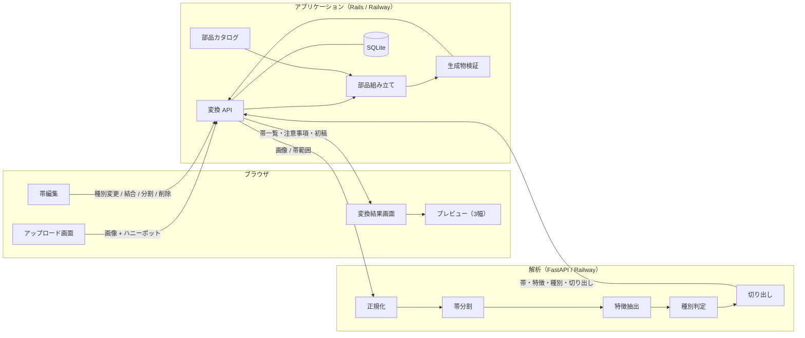

---

## 6. 変換パイプライン仕様

### 6.1 全体方針

- 判定はすべて規則に基づき、同一の画像から同一の出力を得られること（決定性）
- 判定結果には必ず信頼度を付与し、迷いがある場合は注意事項を残すこと。黙って推測しないこと
- 解析層は画像と指示のみを受け取り、状態を持たないこと
- 生成物は外部リソースを一切参照せず、1 ファイルで完結すること

### 6.2 受入検証

| 項目 | 要件 |
|---|---|
| 形式 | PNG・JPEG・WebP のみ。SVG・GIF・PDF・その他は拒否する |
| アニメーション | 複数フレームを持つ画像は拒否する |
| ファイルサイズ | 上限 10 MB |
| 画素数 | 短辺 320 px 以上、幅 8000 px 以下、高さ 20000 px 以下 |
| 回転 | EXIF の回転情報を適用してから解析する |
| 透過 | 透過は白へ合成する |
| 破損 | 復号に失敗した場合は拒否する |
| Bot 対策 | ハニーポット項目に値がある送信は、成功と同じ応答を返しつつレコードを作成しない |

### 6.3 正規化

- 作業幅を 1200 px とし、幅がこれを超える場合のみ縦横比を保って縮小する。拡大は行わない
- 作業画像の四辺の縁の画素から最頻の輝度を求め、テーマ（ライト／ダーク）を判定する。以降の「背景」はこの値を基準とする
- 幅が高さの 0.7 倍未満の画像はモバイル幅デザインとみなし、その旨を注意事項に記録する。処理系統は同一とする

### 6.4 帯分割

**行プロファイル**

作業画像の各行について、内容率（背景と異なる画素の割合）・平均色・エッジ量を算出し、平滑化する。

**区切り候補**

| 候補 | 条件 |
|---|---|
| 空白帯 | 内容率が閾値未満の行が最小連続長以上続く区間 |
| 背景色の急変 | 平均色の行方向の変化量が閾値を超え、変化後の色が最小連続長以上持続する行。緩やかな連続変化（グラデーション）は区切りとしない |
| 画像下端 | 画像状ブロブの下端で、その直後に内容の性質が変わる行 |

**要件**

- 最小帯高は作業座標で 48 px とし、これを下回る帯は隣接する帯へ結合すること。高さ比ではなく絶対値で定義すること
- 帯の上限は 40 とし、超過する場合は最も低い帯を隣接帯へ順に結合し、その旨を注意事項に記録すること
- 区切りが 1 つも検出できない場合は画像全体を 1 帯とし、その旨を注意事項に記録すること
- 先頭帯の上部に、小さな文字状ブロブが横一列に並ぶ領域があり、その領域の高さが作業高さの 8% 以下である場合、その領域をヘッダーとして分離すること（透過ヘッダーがヒーローに重なるデザインへの対処）
- 高さの 80% を超えて縦に貫く区切りが、幅の 30% 未満の位置に存在する場合、外殻レイアウトをサイドバーとし、サイドバー領域を除いた残りの領域に対して帯分割を行うこと。この場合、簡易対応である旨を注意事項に記録すること

### 6.5 帯特徴抽出

**ブロブ分類**

| 分類 | 条件 |
|---|---|
| 文字状 | 高さが小さく、横に長く、同じ高さの塊が同一の基準線上に並ぶ |
| 画像状 | 面積が大きく、内部の色分散が大きい |
| 円形画像状 | 画像状のうち、外形が円に近い |
| ボタン状 | 中程度の大きさの矩形で、背景と対照的な塗りを持ち、内部に文字状ブロブを 1 つ含む |
| アイコン状 | 小さくほぼ正方形で、単色または少数色 |

**帯特徴**

| 特徴 | 算出方法 |
|---|---|
| 列数 | 内容を横軸へ投影し、一定幅以上の空白で区切られた塊の数（1 から 4） |
| 反復項目数 | 大きさと構成が近い塊が等間隔で並ぶ場合の個数 |
| 画像位置 | 画像状ブロブの位置。左・右・上・全面・なし |
| 整列 | 文字状ブロブの重心の横位置。左寄せ・中央 |
| 見出し規模 | 最大の文字状ブロブの高さと、帯内の文字状ブロブの高さの中央値との比 |
| 背景色 | 帯内で最頻の色と、その輝度 |
| アクセント色 | ボタン状ブロブの塗りのうち最も彩度の高い色 |
| 高さ比 | 帯の高さと作業高さの比 |
| 位置 | 先頭・末尾・その他 |

### 6.6 種別判定

各セクション種別について、下表の条件をどれだけ満たすかを重み付きで採点し、信頼度とする。

| 種別 | 主な条件 |
|---|---|
| ヘッダー | 先頭、高さ比 8% 以下、小さな文字状ブロブが横一列、左端に小さな画像状またはアイコン状ブロブ |
| ヒーロー | ヘッダーを除く先頭から 2 帯以内、高さ比 25% 以上または大きな画像状ブロブ、見出し規模が 2 以上、ボタン状ブロブを含む |
| 特徴一覧 | 列数 2 から 4、反復項目数が列数と一致、各項目にアイコン状ブロブと文字状ブロブ |
| 画像と文章 | 画像状ブロブが幅の 35% から 65% を占め、その左右に文字状ブロブが並ぶ |
| 行動喚起帯 | 高さ比 15% 以下、中央整列、見出し規模 1.5 以上、ボタン状ブロブを 1 つ含む、背景が前後の帯と対照的 |
| 料金表 | 列数 2 から 4、各列にボタン状ブロブ、各列に大きく短い文字状ブロブ、列を囲む矩形の枠 |
| 証言 | 反復項目、各項目に円形画像状ブロブと複数行の文字状ブロブ |
| FAQ | 列数 1、高さの近い行が縦に反復、各行の右端にアイコン状ブロブ |
| ギャラリー | 画像状ブロブが 4 つ以上格子状に並び、文字状ブロブが少ない |
| ロゴ帯 | 高さ比 10% 以下、小さな画像状ブロブが 4 から 8 個横一列 |
| フッター | 末尾、小さな文字状ブロブが 2 列以上、または背景がページの背景より暗い |
| 汎用テキスト | 上記のいずれにも該当しない場合の退避先 |

**要件**

- 信頼度が最大の種別を採用すること。最大値が 0.6 以上であれば通常採用とする
- 最大値が 0.4 以上 0.6 未満の場合は採用しつつ、低信頼度である旨を注意事項に記録すること
- 最大値が 0.4 未満の場合は汎用テキストとし、その旨を注意事項に記録すること
- 上位 2 種別の信頼度の差が 0.05 以内の場合は、次点の種別名を注意事項に記録すること
- 料金表と特徴一覧は「各列にボタン状ブロブ」「各項目にアイコン状ブロブ」の有無で区別し、いずれの必須条件も欠く場合はどちらも採用しないこと
- ヘッダーは先頭帯以外に、フッターは末尾帯以外に採用しないこと

### 6.7 パラメータ抽出

- 帯特徴からバリアント（列数・画像位置・整列・テーマ）を決定すること。種別に対して不整合な特徴（例：列数 1 の料金表）の場合は種別の既定バリアントを用い、その旨を注意事項に記録すること
- 帯の背景輝度から帯ごとの文字色（濃・淡）を決定すること
- アクセント色はボタン状ブロブから取得し、存在しない帯はページ全体で最初に得られたアクセント色を用いること
- 文字状ブロブは幅と高さから文字数の区分（見出し・小見出し・本文・ボタン）を推定し、区分に応じたプレースホルダ文言を割り当てること。文字の読み取りは行わないこと
- 画像状ブロブは、作業座標をデザイン画像の座標へ戻して切り出し、長辺 800 px 以下に縮小して生成物へ埋め込むこと
- 切り出し画像の埋め込み合計は 4 MB を上限とすること。上限に達する場合は長辺 400 px までを段階的に縮小し、なお超過する分は無地のプレースホルダに置き換え、その旨を注意事項に記録すること

### 6.8 部品組み立て

**要件**

- 外殻レイアウトを選び、帯の順序どおりに部品を並べること。並べ替えは行わないこと
- 生成物は HTML 1 ファイルとし、CSS はファイル内に記述すること。JavaScript を含めないこと
- 外部リソース（フォント・CSS・スクリプト・画像）を参照しないこと。フォントはシステムフォントの列挙とし、画像はデータ URI で埋め込むこと
- 見出しの階層は h1 を 1 つ（ヒーロー、なければ最初の見出しを持つ帯）とし、以降の帯の見出しは h2、項目の見出しは h3 とすること
- `header`・`main`・`section`・`footer`・`nav` の意味付け要素を用いること
- クラス名は部品ごとに接頭辞を持たせ、部品間で衝突しないこと
- すべての `img` に代替文言を付与すること
- 生成物内に、デザイン画像から読み取った文字を含めないこと（プレースホルダのみ）

### 6.9 生成物検証

組み立て後、下記を機械検査し、いずれかに失敗した場合は生成物を採用せず変換を失敗とすること。

| 項目 | 条件 |
|---|---|
| 外部参照 | `http://` および `https://` を含む属性値が存在しない |
| スクリプト | `script` 要素・イベント属性が存在しない |
| 見出し | h1 がちょうど 1 つ |
| 代替文言 | すべての `img` に `alt` がある |
| サイズ | 6 MB 以下 |
| 構造 | 生成した開始タグと終了タグが対応している |

---

## 7. セクション部品カタログ

| 種別 | スロット | バリアント | 幅 600 px 未満での崩し |
|---|---|---|---|
| ヘッダー | ロゴ・ナビ項目（3 から 6）・ボタン（任意） | ボタン有／無 | ロゴを 1 行目、ナビを折り返して 2 行目以降 |
| ヒーロー | 見出し・本文・ボタン（1 から 2）・画像（任意） | 画像右／画像左／画像下／全面画像／画像なし | 画像を上、文章を下に縦積み |
| 特徴一覧 | 項目（アイコン・小見出し・本文）× n | 2 列／3 列／4 列 | 1 列 |
| 画像と文章 | 画像・見出し・本文・ボタン（任意） | 画像左／画像右 | 画像を上に縦積み |
| 行動喚起帯 | 見出し・本文（任意）・ボタン | ライト／ダーク | そのまま（縦の余白を縮小） |
| 料金表 | プラン（名称・価格・箇条書き・ボタン）× n | 2 列／3 列／4 列、強調列あり／なし | 1 列 |
| 証言 | 項目（円形画像・引用・氏名欄）× n | 1 列／2 列／3 列 | 1 列 |
| FAQ | 質問と回答 × n | 1 列 | そのまま |
| ギャラリー | 画像 × n | 2 列／3 列／4 列 | 2 列 |
| ロゴ帯 | 画像 × n | 4 から 8 個 | 折り返し |
| 汎用テキスト | 見出し・本文段落 × n | 左寄せ／中央 | そのまま |
| フッター | 列（見出し・リンク × n）× m・著作権表示欄 | 2 列／3 列／4 列 | 1 列 |

- 証言の氏名欄・フッターの著作権表示欄はプレースホルダ文言とし、実在の氏名・組織名を生成しないこと
- 外殻レイアウトは「単一カラム」と「サイドバー」の 2 種とする。サイドバーは幅 1024 px 未満で本文の上に縦積みする

---

## 8. レスポンシブ規則

| 項目 | 要件 |
|---|---|
| ブレークポイント | 600 px 未満（モバイル）、600 px 以上 1024 px 未満（タブレット）、1024 px 以上（デスクトップ）の 3 段階 |
| 記述方針 | モバイル幅を基準に記述し、広い幅で列を増やす |
| 格子の崩し | 4 列は 1024 px 未満で 2 列、600 px 未満で 1 列。3 列は 600 px 未満で 1 列。2 列は 600 px 未満で 1 列 |
| 画像と文章 | 600 px 未満では画像位置の左右に関わらず画像を上に置く |
| 画像 | 幅の上限を親要素幅とし、縦横比を保つ |
| 文字 | 見出しの文字サイズは幅に応じて段階的に変え、長い語は強制改行して溢れさせない |
| 最大幅 | 内容の最大幅を 1200 px とし、中央に配置する |
| 文字色 | 帯の背景輝度に応じて濃・淡を切り替え、視認できる対比を保つ |

---

## 9. 帯編集仕様

| 操作 | 内容 | 制約 |
|---|---|---|
| 種別変更 | 帯のセクション種別を利用者が指定する | 12 種のいずれか。ヘッダー・フッターは位置の制約を外して指定可とする |
| 結合 | 隣接する 2 帯を 1 帯にする | 非隣接の結合は拒否する。結合後は特徴を再抽出し種別を再判定する |
| 分割 | 帯を指定の行位置で 2 帯にする | 分割位置が帯の上下端から 48 px（作業座標）以内の場合は拒否する。分割後は両帯の特徴を再抽出し種別を再判定する |
| 削除 | 帯を生成対象から外す | すべての帯を削除した場合は生成物を空のページとし、その旨を表示する |
| 復元 | 削除した帯を戻す | 元の位置へ戻す |

**要件**

- 編集のたびに版を 1 つ進め、再組み立てを行うこと。過去の版の生成物は保持しないこと
- 利用者が指定した種別は、再抽出・再判定によって上書きしないこと（結合・分割で新たに生じた帯を除く）
- 結合・分割で特徴の再抽出が必要な場合、解析層へデザイン画像と帯範囲を渡して行うこと

---

## 10. 異常検知と対処

| 事象 | 検知 | 動作 |
|---|---|---|
| 非対応形式・破損・上限超過 | 受入検証 | 受け付けず、理由を表示する |
| ダーク系デザイン | 縁の最頻輝度が低い | 背景基準を切り替えて処理を継続し、注意事項に記録する |
| 区切りが検出できない | 区切り候補が皆無 | 1 帯として処理し、注意事項に記録する |
| 帯数の超過 | 40 を超える | 最も低い帯から結合し、注意事項に記録する |
| サイドバー型 | 縦に貫く区切り | 外殻をサイドバーとし、簡易対応である旨を注意事項に記録する |
| モバイル幅デザイン | 幅が高さの 0.7 倍未満 | 同一の処理系統で継続し、注意事項に記録する |
| 判定の低信頼度・僅差 | 信頼度の閾値 | 採用または退避し、注意事項に記録する |
| 埋め込み予算の超過 | 切り出し合計が 4 MB 超 | 段階縮小し、超過分をプレースホルダにし、注意事項に記録する |
| 解析のタイムアウト | 解析が 30 秒を超える | 変換を失敗とし、理由を記録して表示する |
| 解析層への到達不能 | 接続失敗 | 変換を失敗とし、理由を記録して表示する |
| 生成物検証の失敗 | 6.9 の検査 | 変換を失敗とし、理由を記録して表示する |
| 解析中の日次リセット | リセットの開始 | 変換を中断とし、理由を記録する |
| 不正な編集操作 | 9 の制約 | 操作を拒否し、理由を表示する |

---

## 11. 排他制御と所有権

**要件**

- 1 セッションで同時に処理中の変換は 2 件までとし、超過分は受け付けず待機を促すこと
- 同一のデザイン画像を繰り返しアップロードした場合、それぞれ独立した変換として扱うこと
- **DB のすべてのテーブルにセッションキーを付与し、セッションキーが一致しないレコードの参照・更新・削除を一切行えないこと**
- 他セッションの変換 ID を指定された場合は、存在の有無を区別せず「見つからない」として応答すること
- 変換の削除は所有セッションのみが行え、削除時にデザイン画像・切り出し画像・生成物をすべて消去すること

---

## 12. 画面仕様

### 12.1 アップロード画面

| 領域 | 内容 |
|---|---|
| 入力 | ファイル選択またはドロップ。受入条件（形式・サイズ・画素数）を表示する |
| 送信 | 変換を開始する。ハニーポット項目を不可視で配置する |
| 一覧 | 自セッションの変換を状態とともに一覧し、結果画面へ遷移できる |

### 12.2 変換結果画面

| 領域 | 内容 |
|---|---|
| 画像と帯 | デザイン画像の上に帯の境界と種別名を重ねて表示する |
| 帯一覧 | 帯ごとに種別・信頼度・バリアントを表示し、種別変更・結合・分割・削除・復元を行う |
| プレビュー | 生成物をモバイル・タブレット・デスクトップの 3 幅で表示する。切替と同時表示を備える |
| 注意事項 | 生成に伴う注意事項を帯ごとに一覧する |
| 出力 | HTML ファイルのダウンロード。現在の版を表示する |
| 状態 | 変換の状態と、失敗・中断の場合はその理由を表示する |

**要件**

- プレビューは生成物を `srcdoc` として読み込む `iframe` に表示し、`sandbox` を付与すること
- 帯編集の操作中は、操作対象の帯を画像上で強調すること

---

## 13. データ設計

### 13.1 テーブル一覧

| テーブル | 用途 |
|---|---|
| sessions | ブラウザごとのセッション |
| conversions | 変換 1 件（状態・外殻レイアウト・テーマ・版） |
| source_images | デザイン画像の本体と寸法 |
| bands | 帯（範囲・特徴・判定種別・利用者指定種別・バリアント・削除の有無） |
| band_crops | 帯に属する切り出し画像 |
| outputs | 現在の版の生成物 |
| notices | 注意事項 |
| conversion_events | 変換中に発生した事象 |

すべてのテーブルは `session_id` を保持し、オーナーキーとして参照条件に必ず含める。

### 13.2 マスタデータ件数

| 区分 | 件数 |
|---|---|
| セクション種別 | 12 |
| バリアント（全種別合計） | 31 |
| 外殻レイアウト | 2 |
| ブレークポイント | 3 |
| ブロブ分類 | 5 |
| 判定規則 | 12 |
| 注意事項種別 | 14 |
| 変換状態 | 8 |
| 帯状態 | 4 |
| 受入形式 | 3 |
| プレースホルダ文言区分 | 4 |

---

## 14. ER図

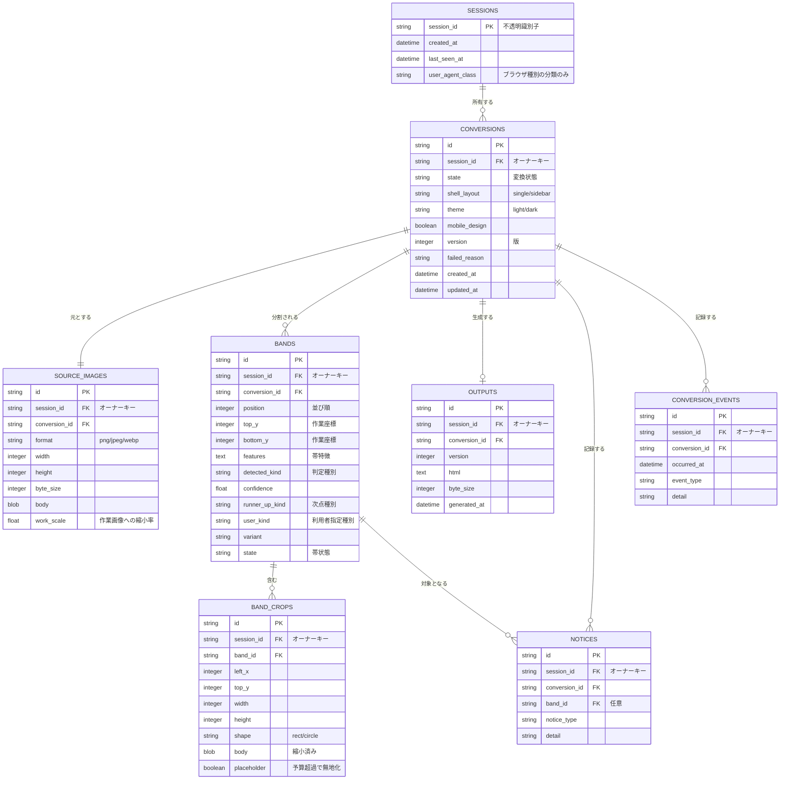

---

## 15. DFD

### 15.1 コンテキストレベル

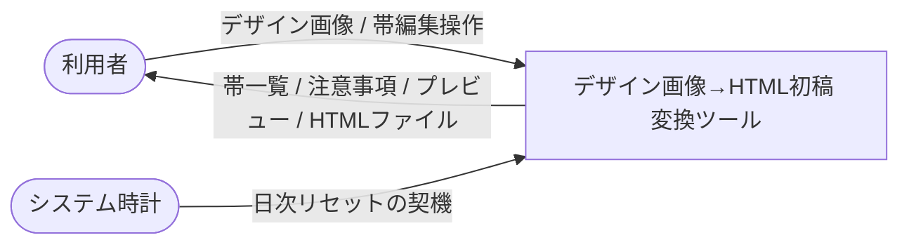

### 15.2 詳細レベル

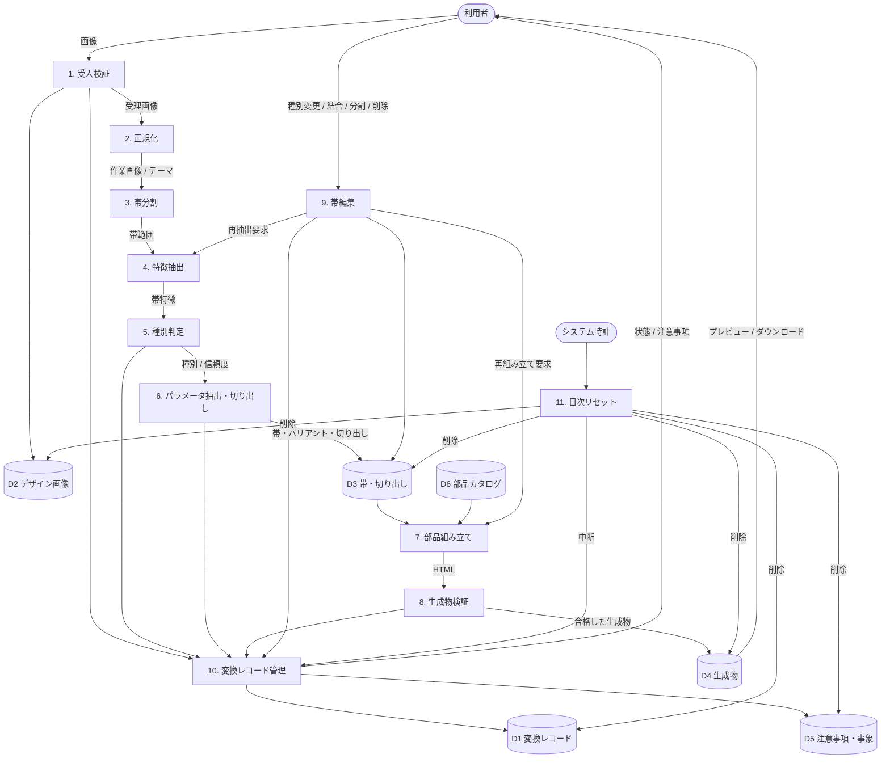

---

## 16. シーケンス図

### 16.1 アップロードから初稿生成

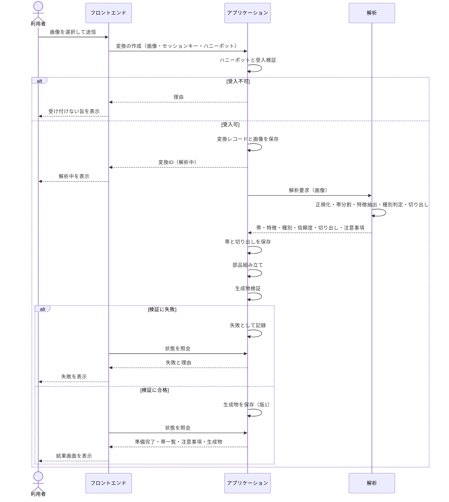

### 16.2 帯編集と再組み立て

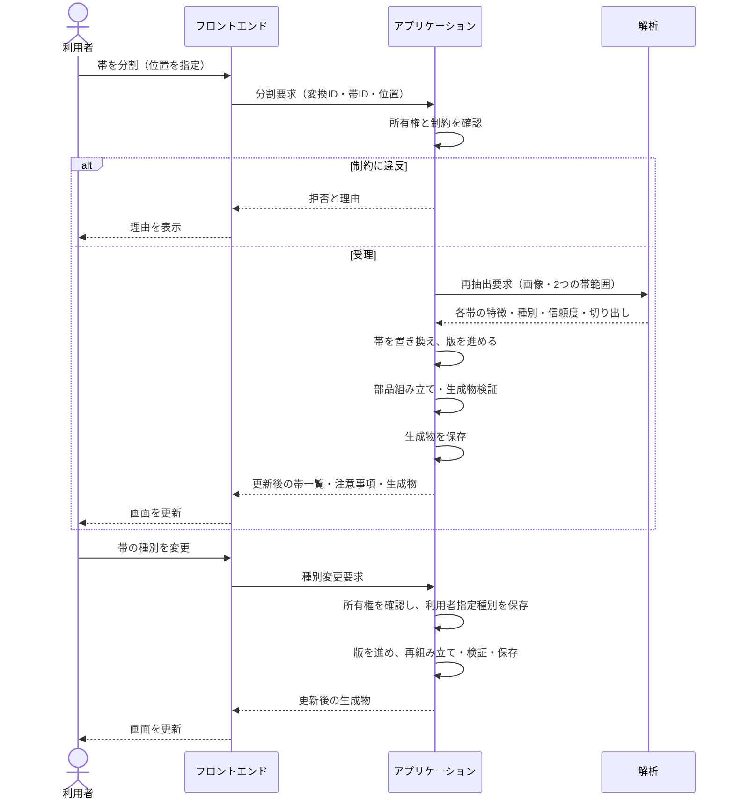

### 16.3 プレビューとダウンロード

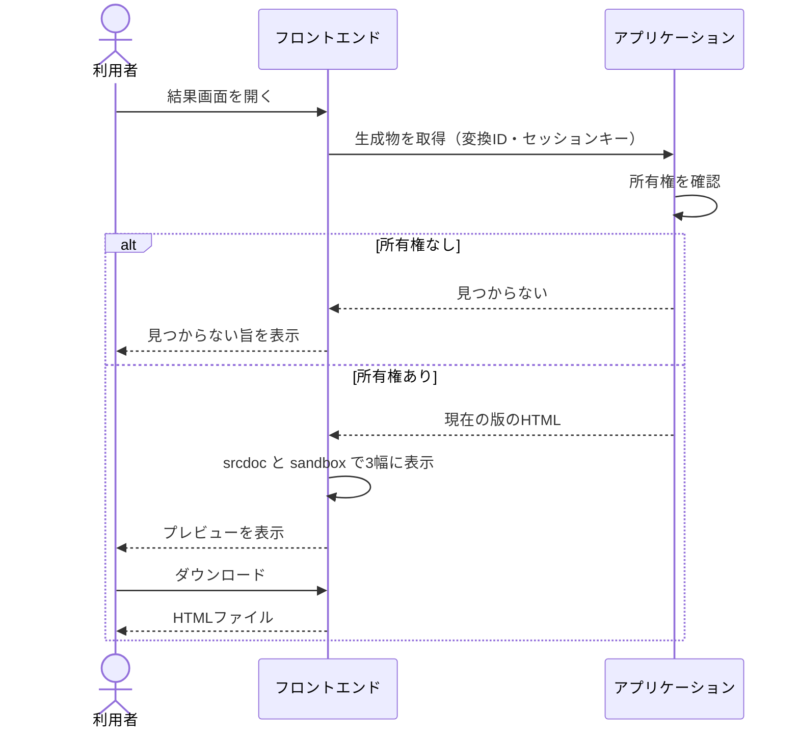

### 16.4 日次リセット

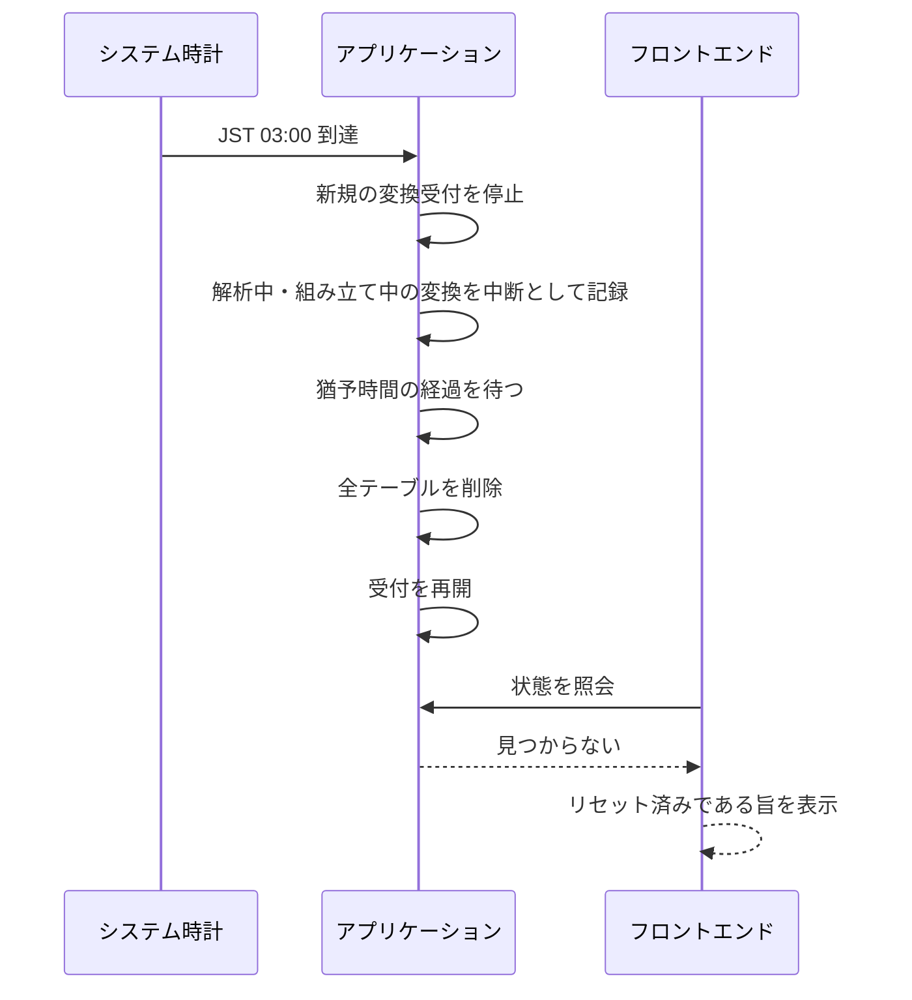

---

## 17. クラス図

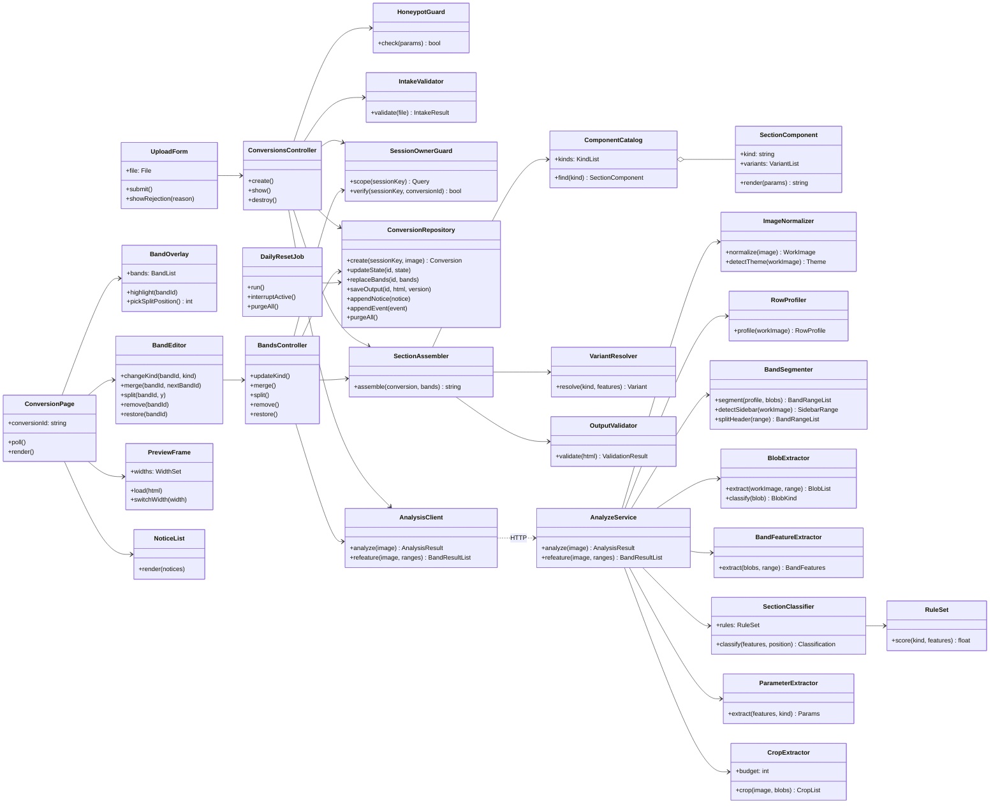

---

## 18. 状態遷移図

### 18.1 変換

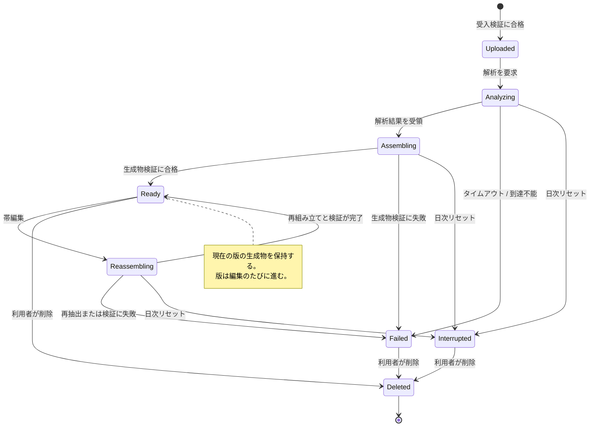

### 18.2 帯

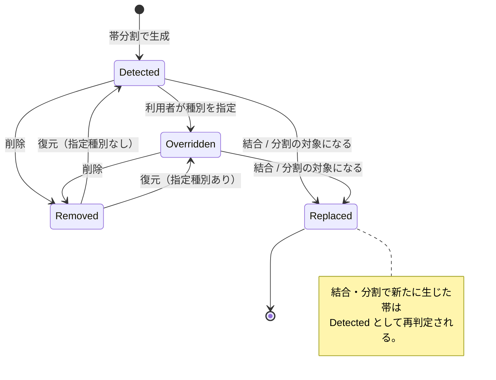

---

## 19. ユースケース図

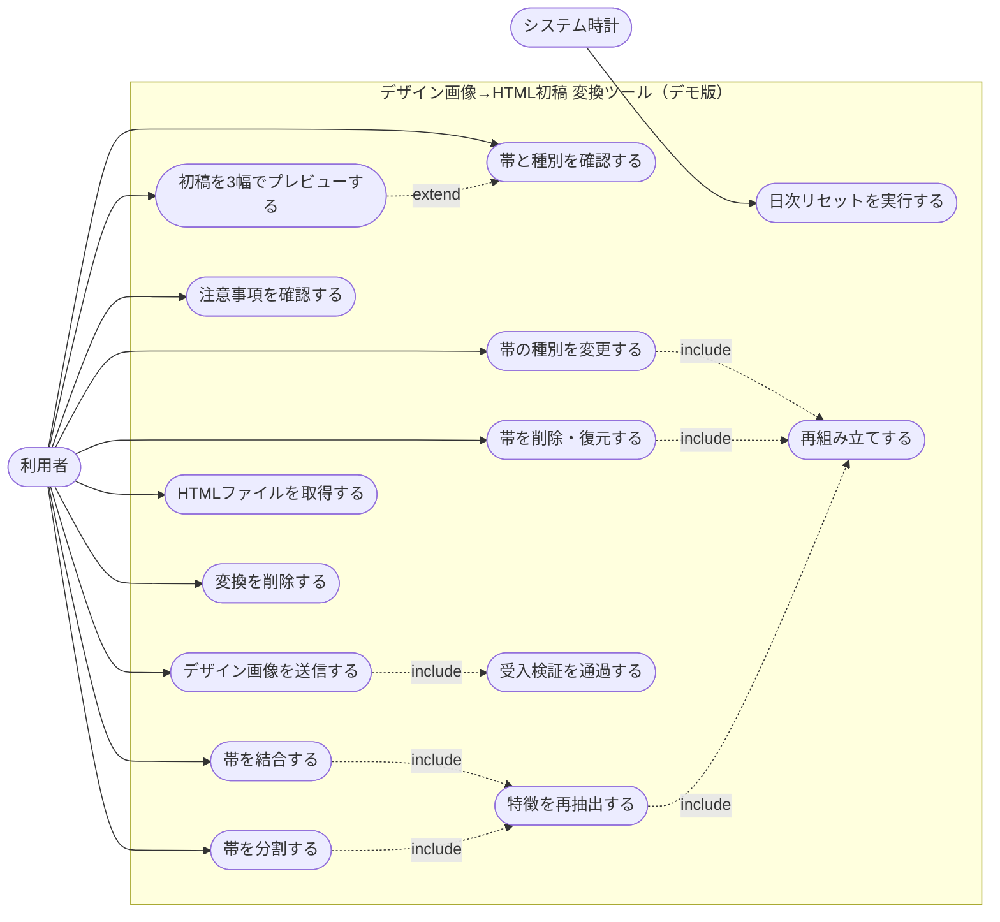

---

## 20. 非機能要件

| 区分 | 要件 |
|---|---|
| 実装方式 | 1 issue のワンショットで実装する |
| 外部通信 | 外部サービスへのネットワーク越しの呼び出しを行わない。資格情報を必要とする通信を持たない |
| 決定性 | 同一の画像と同一の編集操作から同一の生成物を得ること |
| 応答 | 解析は 30 秒で打ち切り、失敗として扱うこと |
| 生成物 | 1 ファイル・6 MB 以下・外部参照なし・JavaScript なし |
| 資源 | 画像・切り出し・生成物は変換の寿命内のみ保持し、削除または日次リセットで消去すること |
| 同時性 | 1 セッションあたり同時処理中の変換は 2 件まで |

---

## 21. セキュリティ・個人情報

**セキュリティ**

- 認証・認可を設計に組み込まない
- セッション管理（Cookie ＋ SQLite）を用い、セッションキーをオーナーキーとして全テーブルに付与する
- セッションをまたいだ DB レコードの参照・操作を行えないこと。他セッションの ID は存在の有無を区別せず「見つからない」とすること
- Bot 対策はハニーポット方式で行う。reCAPTCHA を用いない
- アップロードされたファイルは形式・サイズ・画素数・復号可否を検証し、逸脱するものは保存せず拒否すること
- 生成物のプレビューは `sandbox` 付きの `iframe` で行い、アプリケーションの文脈で実行しないこと

**個人情報**

| 項目 | 扱い |
|---|---|
| 氏名・ニックネーム | 使用しない。生成物の氏名欄・組織名欄はプレースホルダとする |
| メールアドレス | 使用しない |
| 生年月日・住所・電話番号 | 使用しない |
| セッションキー | 端末識別子として扱う |
| デザイン画像 | 文字の読み取りを行わず、レイアウトの解析にのみ用いる。変換の寿命内のみ保持し、共有・公開しない |
| 切り出し画像 | 生成物への埋め込みにのみ用いる。デザイン画像と同じ寿命で消去する |

---

## 22. 運用要件

| 項目 | 内容 |
|---|---|
| DB | SQLite。デプロイ先を問わず SQLite を用いる |
| 日次リセット | JST 03:00 に全テーブルを削除する。実行前に新規受付を停止し、処理中の変換を中断として記録し、猶予時間の経過後に削除する |
| 画像の保持 | 変換レコードと同じ寿命とし、削除と日次リセットで消去する |
| 部品カタログ | コードとして管理し、DB に保持しない |
| 測定 | 行わない |
| 保守・監視 | 行わない |

---

## 23. 対応環境と制約

| 項目 | 内容 |
|---|---|
| 対応ブラウザ | 最新世代のデスクトップ向けブラウザ。モバイルブラウザでも閲覧・ダウンロードは可能とする |
| 対応するデザイン | 単一ページ・縦スクロール型。デスクトップ幅・モバイル幅の両方 |
| 簡易対応となるデザイン | サイドバー型（外殻の切替のみ。サイドバー内部は汎用テキストとする） |
| 対応しないデザイン | 要素が重なり合う絶対配置主体のレイアウト、斜め・曲線の帯境界、横スクロール型。これらは帯分割の精度が下がるため、注意事項と帯編集で補うことを前提とする |
| 生成物の前提 | 初稿であり、文字・装飾・細部は利用者が手直しすること |
| 前提 | 利用者がデザイン画像の利用権を有していること |
